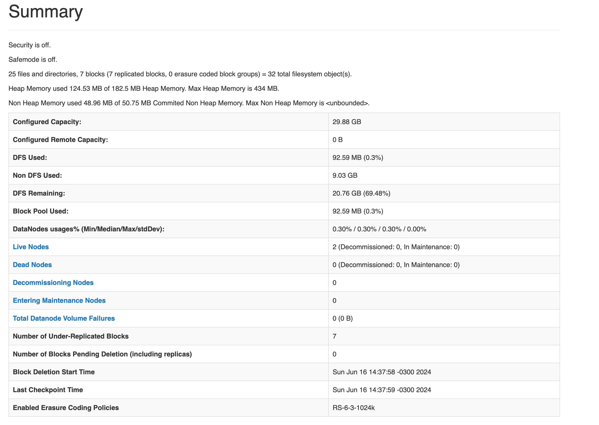

# Data Lake Prime

This project aims to simulate and configure a Distributed File System using Hadoop HDFS. For this project, 3 machines were created: 1 Master Node and 2 Worker Nodes. These were virtualized using the [UTM](https://mac.getutm.app) software under the Fedora 40 Server distribution. Below you can find the summary:



A `wget` function was used to test the server's capabilities to get and store information.


## Table of Contents

- [Data Lake Prime](#data-lake-prime)
  - [Table of Contents](#table-of-contents)
  - [Introduction](#introduction)
  - [Prerequisites](#prerequisites)
  - [Architecture](#architecture)
  - [Installation](#installation)
    - [1. Download Fedora Server Image](#1-download-fedora-server-image)
    - [2. Choose Virtualization Software](#2-choose-virtualization-software)
    - [3. Instantiate Virtual Machines](#3-instantiate-virtual-machines)
    - [4. Install JDK](#4-install-jdk)
    - [5. Enable SSH](#5-enable-ssh)
    - [6. Download Hadoop](#6-download-hadoop)
    - [7. Configure Environment Variables](#7-configure-environment-variables)
    - [8. Configure Hadoop](#8-configure-hadoop)
      - [hadoop-env.sh](#hadoop-envsh)
      - [core-site.xml](#core-sitexml)
      - [hdfs-site.xml](#hdfs-sitexml)
      - [mapred-site.xml](#mapred-sitexml)
      - [yarn-site.xml](#yarn-sitexml)
      - [workers](#workers)
    - [9. Replicate Configurations](#9-replicate-configurations)
  - [Contributing](#contributing)
  - [License](#license)
  - [Contact](#contact)


## Introduction

This project aims to simulate and configure a Distributed File System using Hadoop HDFS, employing a setup with 1 Master Node and 2 Worker Nodes. The setup is virtualized using UTM software on Fedora 40 Server distribution.

## Prerequisites

Before you begin, ensure you have met the following requirements:

- A Linux-based operating system (Fedora 40 Server)
- UTM virtualization software or equivalent
- Root or sudo access to the machines
- One machine with at least 2GB of RAM and 2 machines with at least 1GB of RAM
- Sufficient disk space for Hadoop and its data

## Architecture

This setup includes:

- A single-master, two-worker HDFS cluster
- Configuration files for core Hadoop, HDFS, MapReduce, and YARN


## Installation

Don't forget to change the `/your/hadoop/home` for your actual Hadoop Home!

Another convention used in this document is to put some variables arount `[]`, to facilitate the identification of these variables!

### 1. Download Fedora Server Image

Download the latest version of the Fedora Server image [here](https://fedoraproject.org/server/).

### 2. Choose Virtualization Software

Choose your preferred Virtualization Software. In this case, [UTM](https://mac.getutm.app) was used.

### 3. Instantiate Virtual Machines

Instantiate multiple virtual machines. One will be your `namenode` and the others will be yours `datanodes`.

Don't forget to change the hosts file adding your nodes names and their respective ip addresses. It'll make everything way more easier.

```bash
vi /etc/hosts
```

You can use a template for [hosts file](hosts-config/hosts) available in this repository.

### 4. Install JDK

Install JDK on all your machines. Hadoop recommends JDK 8. Ensure you configure your `JAVA_HOME` variable. Is recommended you to visit the oracle website and choose the desired version.

```bash
wget https://download.oracle.com/[your-download-link]
tar -xvf jdk-[downloaded-jdk-file].tar.gz
```

### 5. Enable SSH

Enable SSH connections on all of your machines by editing the file `/etc/ssh/sshd_config` and ensure that all machines can connect to each other.

```bash
sudo vi /etc/ssh/sshd_config
# Set Port 22
# Set ListenAddress 0.0.0.0
# Set ListenAddress ::
# Set PasswordAuthentication to yes
sudo systemctl restart sshd.service
```

### 6. Download Hadoop

Download the desired Hadoop version from the official site [here](https://hadoop.apache.org/releases.html).

```bash
wget https://www.apache.org/dyn/closer.cgi/hadoop/common/[hadoop-version]/[hadoop-version].tar.gz
tar -xzvf [hadoop-version].tar.gz
mv [hadoop-version] /your/hadoop/home
```

### 7. Configure Environment Variables
Set the `HADOOP_HOME` variable pointing to the path of your unzipped Hadoop download.

```bash
# Set hadoop home
export HADOOP_HOME=/your/hadoop/home
export PATH=$PATH:$HADOOP_HOME/bin

```

### 8. Configure Hadoop

Modify the following files for Hadoop configuration:

#### [hadoop-env.sh](configs/hadoop-env.sh)
```bash
# (...)
# Set Hadoop-specific environment variables here.
export HADOOP_CONF_DIR="${HADOOP_HOME}/etc/hadoop"
export PATH="${PATH}:${HADOOP_HOME}/bin"
export HADOOP_SSH_OPTS="-i ~/.ssh/[ssh-key]"
# (...)
```

#### [core-site.xml](configs/core-site.xml)
```xml
<configuration>
   <property>
     <name>fs.default.name</name>
     <value>hdfs://[name-of-master-node]:19000</value>
   </property>
</configuration>
```

#### [hdfs-site.xml](configs/hdfs-site.xml)
```xml
<configuration>
    <property>
      <name>dfs.replication</name>
      <value>3</value>
    </property>
    <property>
      <name>dfs.namenode.name.dir</name>
      <value>/your/hadoop/home/dfs/namespace_logs</value>
    </property>
    <property>
      <name>dfs.datanode.data.dir</name>
      <value>/your/hadoop/home/dfs/data</value>
    </property>
</configuration>
```

#### [mapred-site.xml](configs/mapred-site.xml)
```xml
<configuration>
    <property>
       <name>mapreduce.job.user.name</name>
       <value>hadoop</value>
    </property>
   
   <property>
      <name>yarn.resourcemanager.address</name>
      <value>[name-of-master-node]:8032</value>
   </property>

   <property> 
	    <name>mapreduce.framework.name</name> 
	    <value>yarn</value> 
   </property>

   <property>
     <name>yarn.app.mapreduce.am.env</name>
     <value>HADOOP_MAPRED_HOME=/your/hadoop/home</value>
   </property>

   <property>
     <name>mapreduce.map.env</name>
     <value>HADOOP_MAPRED_HOME=/your/hadoop/home</value>
   </property>

   <property>
     <name>mapreduce.reduce.env</name>
     <value>HADOOP_MAPRED_HOME=/your/hadoop/home</value>
   </property>

</configuration>
```

#### [yarn-site.xml](configs/yarn-site.xml)
```xml
<configuration>

  <property>
     <name>yarn.resourcemanager.hostname</name>
     <value>[name-of-master-node]</value>
  </property>

  <property>
     <name>yarn.nodemanager.resource.memory-mb</name>
     <value>1536</value>
  </property>

<!-- Too long to display. You can find the complete version clicking in the file title. -->
</configuration>
```

#### [workers](configs/workers)
```text
[worker-name2]
[worker-name2]
```

### 9. Replicate Configurations
Replicate the configurations to all other nodes using the `scp` command.

```bash
scp -r /your/hadoop/home/etc/hadoop/* <username>@[worker-name1]:/your/hadoop/home/etc/hadoop/
scp -r /your/hadoop/home/etc/hadoop/* <username>@[worker-name2]:/your/hadoop/home/etc/hadoop/
```

After you done, you can start the cluster:

```bash
/your/hadoop/home/sbin/start-dfs.sh
/your/hadoop/home/sbin/start-yarn.sh
```


For more details on cluster configuration, refer to the [Hadoop Single Cluster documentation](https://hadoop.apache.org/docs/stable/hadoop-project-dist/hadoop-common/SingleCluster.html).

For a more straightforward guide, visit [Linode's Hadoop Cluster Setup Guide](https://www.linode.com/docs/guides/how-to-install-and-set-up-hadoop-cluster/).

## Contributing

Contributions are welcome! Please fork this repository and submit a pull request with your changes.

## License

MIT License

Copyright (c) 2024 Mikeias Oliveira

Permission is hereby granted, free of charge, to any person obtaining a copy
of this software and associated documentation files (the "Software"), to deal
in the Software without restriction, including without limitation the rights
to use, copy, modify, merge, publish, distribute, sublicense, and/or sell
copies of the Software, and to permit persons to whom the Software is
furnished to do so, subject to the following conditions:

The above copyright notice and this permission notice shall be included in all
copies or substantial portions of the Software.

THE SOFTWARE IS PROVIDED "AS IS", WITHOUT WARRANTY OF ANY KIND, EXPRESS OR
IMPLIED, INCLUDING BUT NOT LIMITED TO THE WARRANTIES OF MERCHANTABILITY,
FITNESS FOR A PARTICULAR PURPOSE AND NONINFRINGEMENT. IN NO EVENT SHALL THE
AUTHORS OR COPYRIGHT HOLDERS BE LIABLE FOR ANY CLAIM, DAMAGES OR OTHER
LIABILITY, WHETHER IN AN ACTION OF CONTRACT, TORT OR OTHERWISE, ARISING FROM,
OUT OF OR IN CONNECTION WITH THE SOFTWARE OR THE USE OR OTHER DEALINGS IN THE
SOFTWARE.

## Contact

<p align="left">
  <a href="malito:mikeias.d.s.o@gmail.com" alt="Gmail">
  </a>

  <a href="https://www.linkedin.com/in/mikeias-d-s-o/" alt="Linkedin">
  </a>

</p>  
